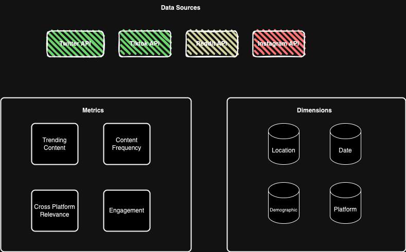

# Multi-Platform Social Media Trend Analysis

## Project Overview:
To analyze and understand trends across various social media platforms (X, Reddit, TikTok, and Instagram) by examining hashtags, content themes, engagement metrics, and demographic insights. This project aims to identify cross-platform correlations and user engagement patterns to provide a comprehensive understanding of social media dynamics.

## Motivation:
Social media platforms play a crucial role in shaping public opinion, driving consumer behavior, and fostering global connectivity. Understanding trends and engagement patterns across these platforms is essential for businesses, marketers, and content creators to stay relevant and competitive. My aim is to harness the power of data from multiple social media sources to provide comprehensive insights into what's trending, how users are engaging, and the underlying drivers of these behaviors.

## Data Sources:
- X Trends
- Reddit
- Tiktok
- Instagram (Subject to permissions)

## Conceptual Data Model:

## Insights and Use Cases

### Hashtag Analysis:
- Identify popular hashtags over time on each platform.
- Compare hashtag trends across platforms to see which hashtags are universally popular and which are platform-specific.

### Content Themes:
- Determine common themes or topics in trending content on each platform.
- Analyze the consistency of content themes across different platforms.

### Demographic Analysis:
- Age Group Analysis: Segment trends by age groups to see what different demographics are interested in.
- Geographic Analysis: Identify trends in different geographic regions.
- Gender Analysis: Compare how trends vary between different genders.

### Cross-Platform Trend Correlation:
- Topic Consistency: Identify if certain topics are trending simultaneously on TikTok, Reddit, and Instagram.
- Viral Content: Track the virality of specific content across platforms to understand cross-platform influences.
- User Migration: Analyze if users are discussing the same topics across different platforms.

## Methodology
### Data Collection: 
Utilize APIs from X, Reddit, TikTok, and Instagram to collect data on hashtags, content themes, engagement metrics, and demographics at regular intervals, storing it in a centralized database.

### Preprocessing: 
Clean, normalize, tokenize text data, and perform sentiment analysis to prepare data for analysis.

### Hashtag Analysis: 
Calculate hashtag frequency, detect trending hashtags, compare trends across platforms, and analyze growth rates.

### Extract Content Themes: 
Use topic modeling to identify themes, categorize content, analyze engagement metrics and sentiment scores for each theme.

### Demographic Analysis: 
Segment data by age, gender, and location, measure trend popularity and engagement metrics for each segment, and compare across demographics.

### Cross-Platform Trend Correlation: 
Identify consistent topics across platforms, track viral content spread, analyze user migration, and calculate correlation metrics.

### Visualization: 
Develop interactive dashboards and visualizations using tools like Tableau, create time series plots, geographic maps, demographic charts, and sentiment analysis visuals to display key metrics and trends. [Possible Future Implementation]
